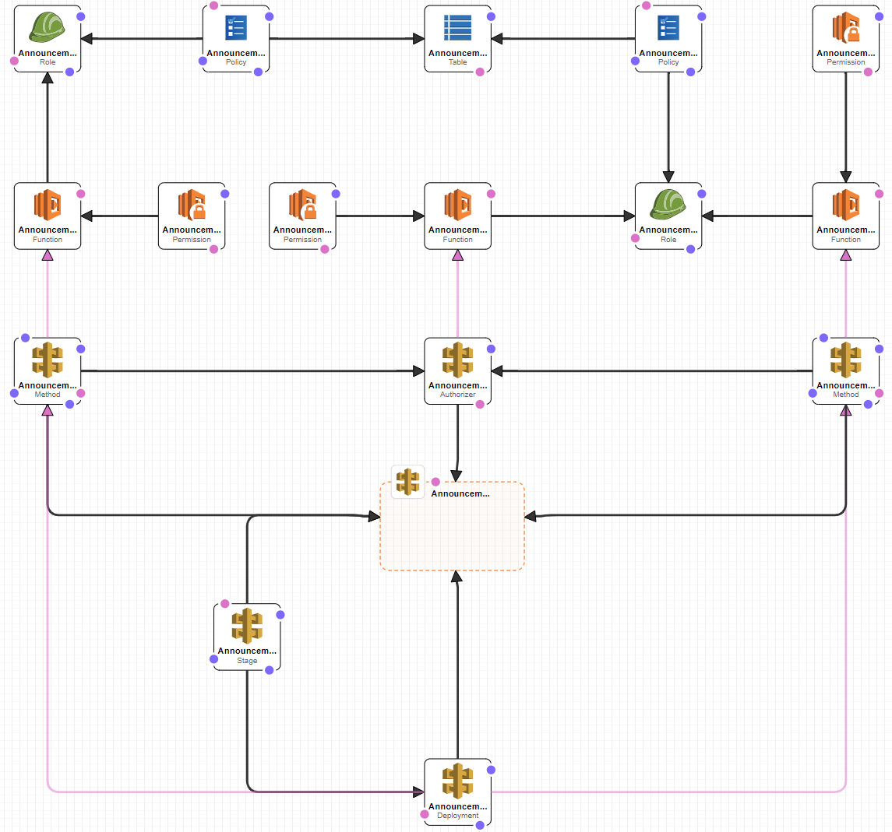

**How to deploy and test**

1. Create a bucket in the target region (bucket name will be a parameter to Cloud Formation stack); . 
2. Put main.py into zip archive (for example `announcements.zip`, archive name will be parameter to CF stack);
3. Upload `announcements.zip` into bucket from (1)
3. Create CF stack (using `announcements.cf_template.json` file, it can be imported in Template Designer to see the resulting architecture) in the same region as bucket from (1);
4. After stack creation is complete open up Outputs tab and copy `DeployedApiEndpoints` URL;
5. Import `Announcements.postman_collection.json` into Postman;
6. Edit imported Postman collection to update `API_URL` collection variable to match `DeployedApiEndpoints`;
7. Try sending all requests from the collection (check tests tab to see tests pass). If sending "List Announcements" request returns `{"message": null}` you need to wait some time before trying to send requests (API deployment isn't finalized yet).

**Resulting architecture**

**Notes**

All the objects created by CF stack can be removed by deleting the stack.
S3 bucket must be removed manually (since it was created manually).

**Costs**

You will be charged for accessing API endpoints, lambdas, DynamoDB and S3.
The costs are hardly noticeable though (unless you decide to DDoS your deployment which will result in increased costs for lambdas and Dynamo).
